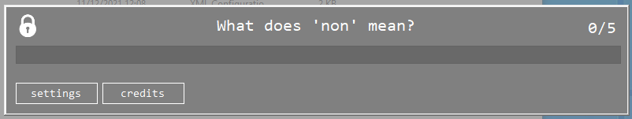
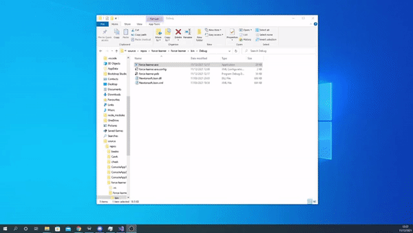

# Force-learner


### version 2
An feature-packed updated version will be released as soon as i have more time <3 

### Force learner is a way to force you to learn
I have been asked by my french teacher to create an application to force me to learn french words, and here it is! It is a very compact file which when run, will be hard to stop. Therefore, make sure you're learning well. To deactivate this program, open task manager and locate 'force-learner'. I have opted out of making this deactivatable for the sole reason of me being cheeky enough to deactivate it if i cannot feel like doing my french work.\
\

\

### how it works
This appliation forces you to write down the meanings of words which are defined in a **wordlist**. By default, it will refer to the wordlist on this repository (https://github.com/biegaj/force-learner/blob/main/wordlist.txt). 
\
It will loop through every line of the word list and sort words into keys and values, which will then be displayed on the master form
\
\
You may edit this to your own repository to implement your own words. It will loop around words randomly, but in future version I will add recognitions for repeated words. This project took approx. 2 hours so there will be bugs.
```
Key: Value 
``` 
You must define what word you want and what value it has. For example, 'bonjour: hello' will be seen as:\
"What does 'bonjour' mean" to where the end user must input 'hello' 

